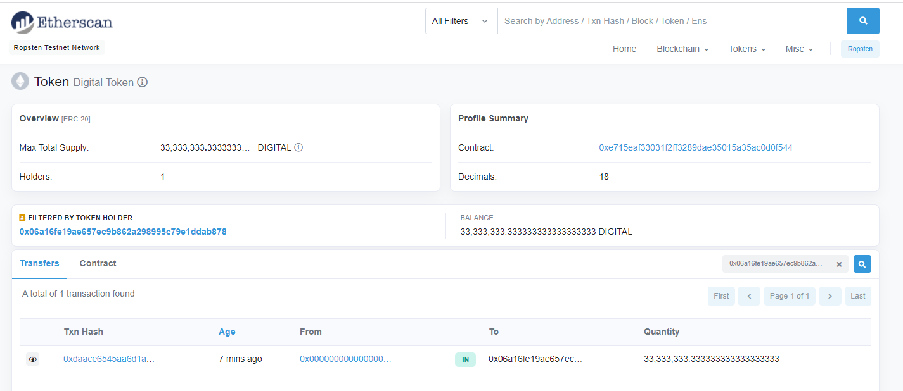
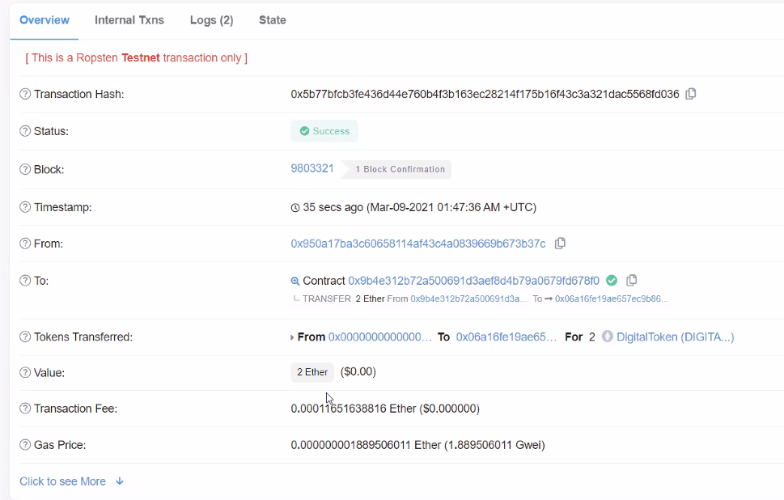
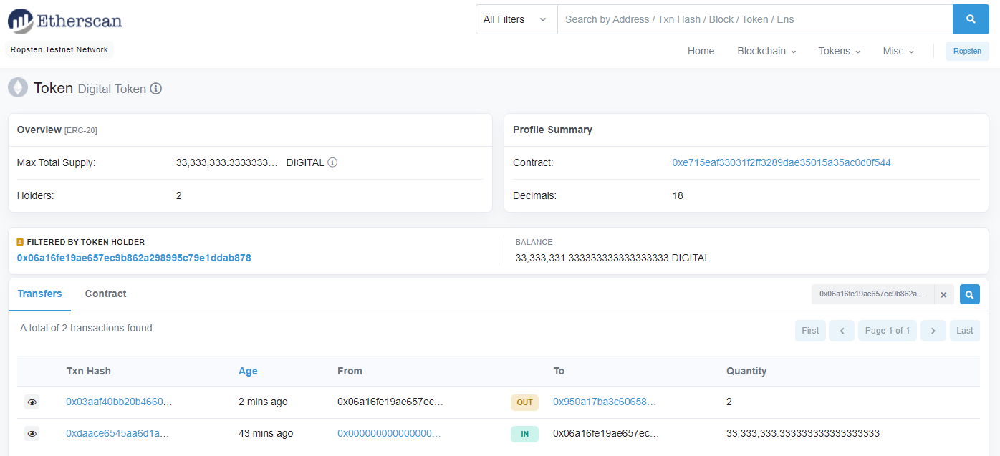
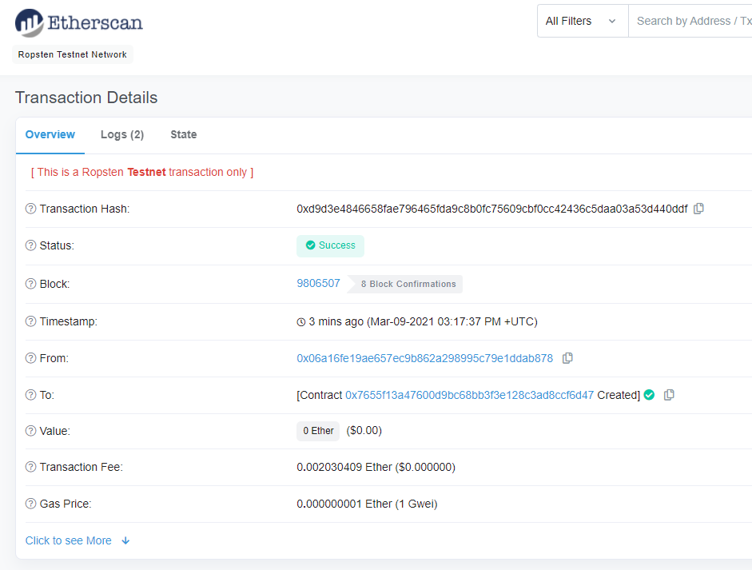

# **Project 3: Smart Tokens - ERC20 for Equity Certificates through Smart Contracts**

### *Team 2: Lynette Cary, Marius Nsamou, Nigil Jeyashekar, Rajiv Shrestha and Rawad Habib*

 

## Dependencies
- [Remix IDE](https://remix.ethereum.org) is used to create the smart contracts 
- [Ganache](https://www.trufflesuite.com/ganache) is used to develop a personal blockchain network to deploy the smart contracts, develop applications and run tests 
- [MetaMask extension for Google Chrome](https://chrome.google.com/webstore/detail/metamask/nkbihfbeogaeaoehlefnkodbefgpgknn?hl=en) uses the Ropsten Test Network to send transactions 
- [Pinata](https://pinata.cloud/pinexplorer) is a cloud storage that can be used to store data and certificates issued 

 

## **Concept Creation**  

### Regulation of Digital Assets
The Commodity Futures Trading Commission (CFTC) oversees the digital assets market, which include *"anything that can be stored and transmitted electronically and has associated ownership and rights." "Digital assets offer benefits of increased transaction speed, efficiency, certainty, "democratization" of markets and financial inclusion, automation through smart contracts, greater liquidity for assets, and enhanced security."*1

### Challenges to Investing in Private Equity Firms
"*Past issues with investing in private equity have included a lack of opportunity as many private firms work directly with individual brokers and with the lack of necessary relationships it is increasingly difficult to take advantage of investment opportunities.  Tokenization and blockchain technology opens more opportunities for issuers to connect directly with investors and the technology processes transactions quickly and efficiently.*" 2

 

## **ERC20 Extension to Tokenize Private Equity Shares in a Privately-Held Company**

For the purposes of this project, we created an Ethereum smart contract called `DigitalToken`, a proposed ERC20-compatible token, that allows for the creation and issuance of a Private-held company's tokenized equity in exchanged for Ether.  The purpose of tokenizing equity is to raise capital for the company by issuing shares in the form of digital assets (tokens).  Tokenization creates transparency and the use of blockchain technology creates an immutable storage of all data related to the issuance of the shares in the company including the balance of remaining tokens, history of ownership, and the amount raised.  

**What is a blockchian?**  A blockchain is a peer-to-peer network of nodes or distributed networks that connect individual nodes on the blockchain that all work together to make sure the data is secure and unchangeable.  The individual nodes contain a copy of the code and the data on the blockchain.  The  data is contained in blocks and are chained together, hence a blockchain.  

**What is a smart contract?** All of the code on the blockchain is contained in a smart contract, which is the program that runs on the blockchain and once deployed it is unchangeable.  

 

### **Project Setup**
As referenced above, dependencies are installed and setup for use in this project.  Transactions were completed using accounts from the Ethereum wallet created in Ganache and used to connect to the blockchain network.  

The smart contracts created in this project **reference Unit 21 - Advanced Solidity class activities as starter code** and contain the logic to tokenize and issue equity for the firm.  The Ethereum smart contract was created using the solidity programming language and imports the standards from OpenZeppelin contracts for a more secure smart contract development.  The contract was compiled and deployed to a blockchain.  The contract code was tested and deployed to a blockchain using the Ropsten Test Network on Metamask.  

### **Smart Contract Logic**
`DigitalToken` contract: 
The following variables are set in the contract: 
- contract `owner` is set to msg.sender (Private Equity Firm) 
- `symbol` is set to `DIGITAL` (represents the tokenized equity) 
- `exchange_rate` is set to equal 100 shares to be distributed per `Ether` exchanged 

The following functions were added to the `DigitalToken` contract: 
- Function `balance` returns the available owner shares 
- Function `transfer` accepts the recipient (Investor) address to make the transfer of shares from the owner to the recipient (Investor) 
- Function `purchase` calculates the number of shares to distribute and adds a value to the shares for transfer to the owner address 
- Function `mint` allows the Firm to create tokens when needed  

`DigitalTokenERC20` contract:  
The contract is created and passes the following variables for the contract:  
- `name` of the token `Digital Token` 
- `symbol` of the token `DIGITAL` 
- `18 decimals` sets the decimal places to accept Ethereum in the contract 

The constructor calls the internal `_mint` function to set an `initial_supply` of shares available to the owner.  All shares were initially minted. 

`DigitalTokenMinted` contract:  
The contract allows for the `DigitalToken` contract to mint an initial supply of tokens and to mint additional tokens if needed.

`DigitalTokenSale` contract: 
The contract is created to manage the sale and minting of the Digital Tokens (shares).  A constructor is added to the contract to fulfill the following parameters: 
- `rate` for the conversion between wei and the token unit 
- ` wallet` address is used to receive the Ether from the sale of the digital asset 
`token` is set to the actual `DigitalToken` created and is compatible with the ERC20 interface that the crowdsale contract requires 

The body of the constructor is empty and will inherit the logic from the OpenZeppelin `Crowdsale` and `MintedCrowdsale` contracts.

`DigitalTokenSaleDeployer` contract: 
The contract is created to store the addresses from the `DigitalToken` and `DigitalTokenSale` once deployed.  The following parameters are set in the contract: 
- `rate` is hardcoded to `1` to maintain the same units as Ether that will be exchanged 
- `wallet` is the same from the main constructor that will receive all Ether that is raised by the `DigitalTokenSale`  
- `token` is where the `DigitalToken` is stored 

The `DigitalTokenSale` contract is set as a minter and then set to renounce the mintership from the `DigitalTokenSaleDeployer` to the `DigitalTokenSale` as the actual minter.

 

## **Contracts Deployed**

### **Ganache Accounts Used for Owner/Investor** 

(owner account) 0x06A16FE19aE657ec9b862a298995C79e1dDAB878 
(investor account) 0x950A17ba3C60658114AF43C4a0839669b673B37C 

 

### **Digital Tokens Minted**

 

### **Investor Purchase of Digital Tokens** 
*(Transaction: 2 Ether are exchanged for 200 Digital Tokens)* 

 

### **Private Equity Firm Transfers 200 Digital Tokens** 

 

### **Private Equity Firm Issues Certificate of Purchase to Investor** 

 

## **Conclusion**
The pros for using blockchain technology and smart contracts increases the private equity firm's access to raise capital and provides investors with direct access to purchase equity in the firm.  

The cons identified during the project are:
    
1) Blockchain has limitations to the amount of data that can be stored.  For a small firm the number of transactions are small enough to benefit from using the steps provided in this project.  For larger firms with an increased number of transactions, we explored the option of using IPFS to store large amounts of data and certificates including the benefits that IPFS offers to provide verifiability on behalf of the firm.  

2) There is an increase in gas fees to the firm each time tokens and certificates are issued.  While there are various methods that can be utilized to help lower gas fees, we specifically identified that reducing the storage and size of variables used in writing smart contracts can help to reduce gas costs.  

 

## **Future Work**
If more time was available, the group could explore adding machine learning models into the project as large amounts of data can be analyzed better using machine learning algorithms.  We could also further develop our contracts to fully utilize IPFS for storing data and certificates. 

 

## **References**
1 CFTC Digital Assets Primer https://www.cftc.gov/media/5476/DigitalAssetsPrimer/download 

2 Invest in Private Equity? Here are the Top 4 Reasons to Get Excited for Tokenization https://medium.com/blockstation-blog/invest-in-private-equity-here-are-the-top-4-reasons-to-get-excited-for-tokenization-5da6ea6fc894)